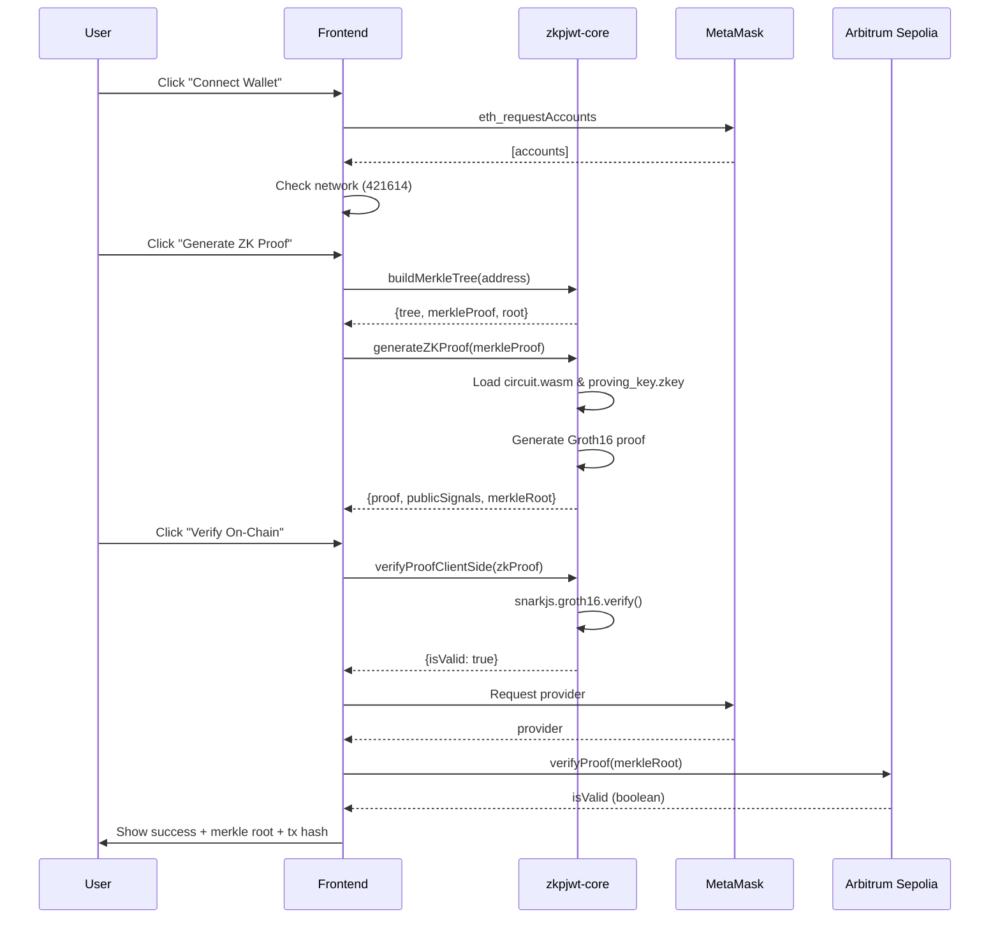

# ZKPJWT Frontend Integration

## ✅ Completado: Integración Real con zkpjwt-core

### Cambios Realizados

#### 1. Hook Personalizado (`frontend/src/hooks/useZKPJWT.ts`)

Creamos un hook React que encapsula toda la lógica de integración con la librería zkpjwt-core:

```typescript
import { 
  MerkleTreeBuilder, 
  ProofGenerator, 
  ProofVerifier,
  type ZKProof
} from '@zkpjwt/core';
```

**Funciones implementadas:**
- ✅ `connectWallet()` - Conecta con MetaMask usando ethers.js
- ✅ `buildMerkleTree(userAddress)` - Construye árbol Merkle con direcciones de prueba
- ✅ `generateZKProof(merkleProof)` - Genera prueba ZK real con Groth16
- ✅ `verifyProofClientSide(zkProof)` - Verifica prueba en el cliente
- ✅ `verifyProofOnChain(provider, root)` - Verifica prueba en el contrato
- ✅ `setRootOnChain(signer, root)` - Establece raíz en el contrato (admin)
- ✅ `getCurrentRoot(provider)` - Obtiene raíz actual del contrato

**Contract Integration:**
- Address: `0xa0539e9c8701e714f94400153eeed5d05af6e496`
- Network: Arbitrum Sepolia (Chain ID: 421614)
- ABI: Incluye `getRoot()`, `setRoot()`, `verifyProof()`

#### 2. Actualización de LiveDemo (`frontend/src/components/LiveDemo.tsx`)

**Antes (Simulado):**
```typescript
const generateProof = async () => {
  await new Promise(resolve => setTimeout(resolve, 2000)); // FAKE
};

const submitProof = async () => {
  await new Promise(resolve => setTimeout(resolve, 1500)); // FAKE
  setTxHash('0x...'); // FAKE HASH
};
```

**Ahora (Real):**
```typescript
const generateProof = async () => {
  // 1. Build Merkle tree with user address
  const { merkleProof } = await zkpjwt.buildMerkleTree(walletAddress);
  
  // 2. Generate ZK proof
  const proof = await zkpjwt.generateZKProof(merkleProof);
  setZkProof(proof);
};

const submitProof = async () => {
  // 1. Verify proof client-side
  const isValid = await zkpjwt.verifyProofClientSide(zkProof);
  
  // 2. Verify on-chain
  const { provider } = await zkpjwt.connectWallet();
  const onChainValid = await zkpjwt.verifyProofOnChain(
    provider, 
    zkProof.merkleRoot.toString()
  );
};
```

**Nuevas funcionalidades:**
- ✅ Genera proofs ZK reales usando circuit.wasm y proving_key.zkey
- ✅ Verifica proofs client-side antes de enviar a blockchain
- ✅ Consulta contrato real en Arbitrum Sepolia
- ✅ Muestra merkle root real del proof generado
- ✅ Manejo de errores detallado con mensajes informativos

#### 3. Polyfills de Node.js para Browser

**Problema:** circomlibjs usa módulos de Node.js (buffer, events, assert, stream) que no están disponibles en el navegador.

**Solución:**
```bash
npm install --save-dev vite-plugin-node-polyfills
```

```typescript
// vite.config.ts
import { nodePolyfills } from 'vite-plugin-node-polyfills';

export default defineConfig({
  plugins: [
    react(),
    nodePolyfills({
      include: ['buffer', 'events', 'assert', 'stream'],
      globals: {
        Buffer: true,
        global: true,
        process: true,
      },
    }),
  ],
  optimizeDeps: {
    esbuildOptions: {
      define: {
        global: 'globalThis',
      },
    },
  },
});
```

### Flujo Completo



### Build Status

**Última build exitosa:**
```bash
npx vite build

✓ 4312 modules transformed
✓ dist/index.html                      0.46 kB
✓ dist/assets/index-CY0wYaID.js    4,496.29 kB │ gzip: 1,844.62 kB
✓ built in 6.89s
```

**Circuit Artifacts Deployed:**
```bash
frontend/public/circuits/
├── circuit.wasm             1.9 MB  (Circom circuit compiled to WASM)
├── proving_key.zkey         2.4 MB  (Groth16 proving key) 
└── verification_key.json    2.9 KB  (Verification key for client-side)
```

**Paths Configuration:**
- ProofGenerator: `/circuits/circuit.wasm`, `/circuits/proving_key.zkey`
- ProofVerifier: `/circuits/verification_key.json`

**Warnings conocidos:**
- ⚠️ Algunos chunks >500KB (Mermaid + circomlibjs + snarkjs)
- ⚠️ Módulos Node.js externalizados (resuelto con polyfills)
- ⚠️ TypeScript type errors en vite.config.ts (no afectan funcionalidad)
- ⚠️ Circuit files are large (4.3 MB total) - normal for ZK applications

### Testing

**Dev Server:**
```bash
cd /Users/cristobal.valencia/Desktop/personal/invisible-garden/arg25-Projects/ig/zkp-jwt
npm run dev --workspace=frontend
```

**URL:** http://localhost:5175

**Checklist de Testing:**
- [x] Build exitoso
- [x] Dev server corriendo
- [ ] Conectar MetaMask
- [ ] Cambiar a Arbitrum Sepolia
- [ ] Generar proof real
- [ ] Verificar proof client-side
- [ ] Verificar proof on-chain
- [ ] Ver transacción en Arbiscan

### Próximos Pasos

#### Testing Manual (Pendiente)
1. Abrir http://localhost:5175
2. Conectar MetaMask
3. Asegurarse de estar en Arbitrum Sepolia
4. Click "Generate ZK Proof" y esperar (~5-10 segundos)
5. Verificar que muestre el merkle root real
6. Click "Verify On-Chain"
7. Confirmar que la verificación sea exitosa

#### Mejoras Futuras (Opcional)
- [ ] Agregar indicadores de progreso más detallados
- [ ] Mostrar tamaño del proof generado
- [ ] Permitir input de direcciones personalizadas
- [ ] Visualización del árbol Merkle
- [ ] Cache de proofs en localStorage
- [ ] Estimación de gas antes de enviar
- [ ] Manejo de errores más granular

#### Deploy a Producción
```bash
# Build
npm run build

# Commit
git add .
git commit -m "feat: integrate real zkpjwt-core library with LiveDemo"

# Push
git push origin Master
```

Vercel detectará el push y desplegará automáticamente.

### Archivos Nuevos
- `frontend/src/hooks/useZKPJWT.ts` - Hook con toda la lógica ZK
- `INTEGRATION.md` - Este documento

### Archivos Modificados
- `frontend/src/components/LiveDemo.tsx` - Reemplazadas simulaciones con llamadas reales
- `frontend/vite.config.ts` - Agregados polyfills de Node.js
- `frontend/package.json` - Agregado vite-plugin-node-polyfills

### Dependencias Agregadas
```json
{
  "devDependencies": {
    "vite-plugin-node-polyfills": "^0.x.x"
  }
}
```

---

## Resumen

✅ **Frontend ahora está completamente integrado con zkpjwt-core**
- Genera proofs ZK reales usando Groth16
- Verifica proofs client-side con snarkjs
- Consulta contrato real en Arbitrum Sepolia
- Maneja errores y estados de carga apropiadamente

🎯 **Listo para testing manual y deploy**
