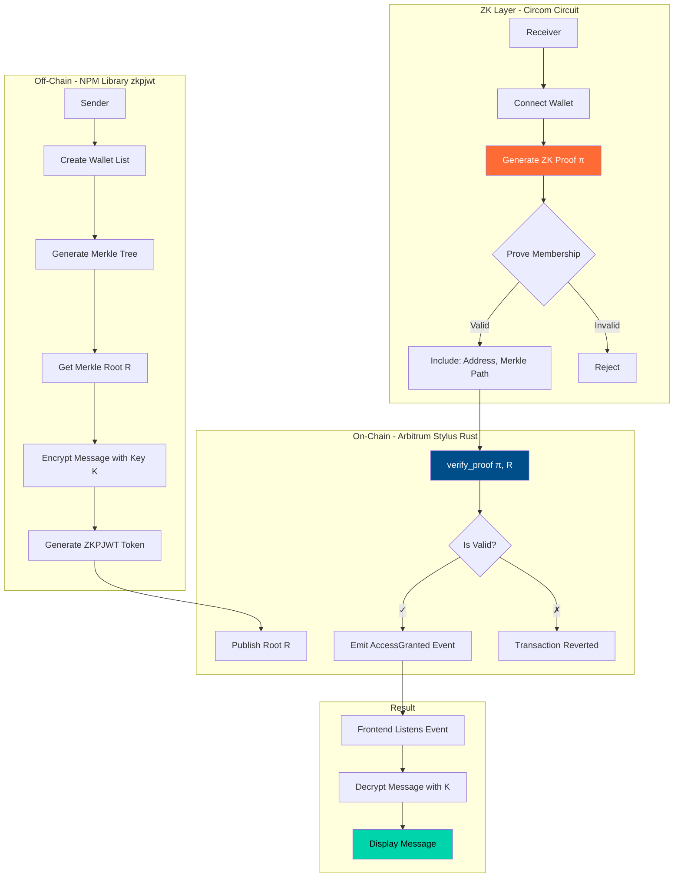
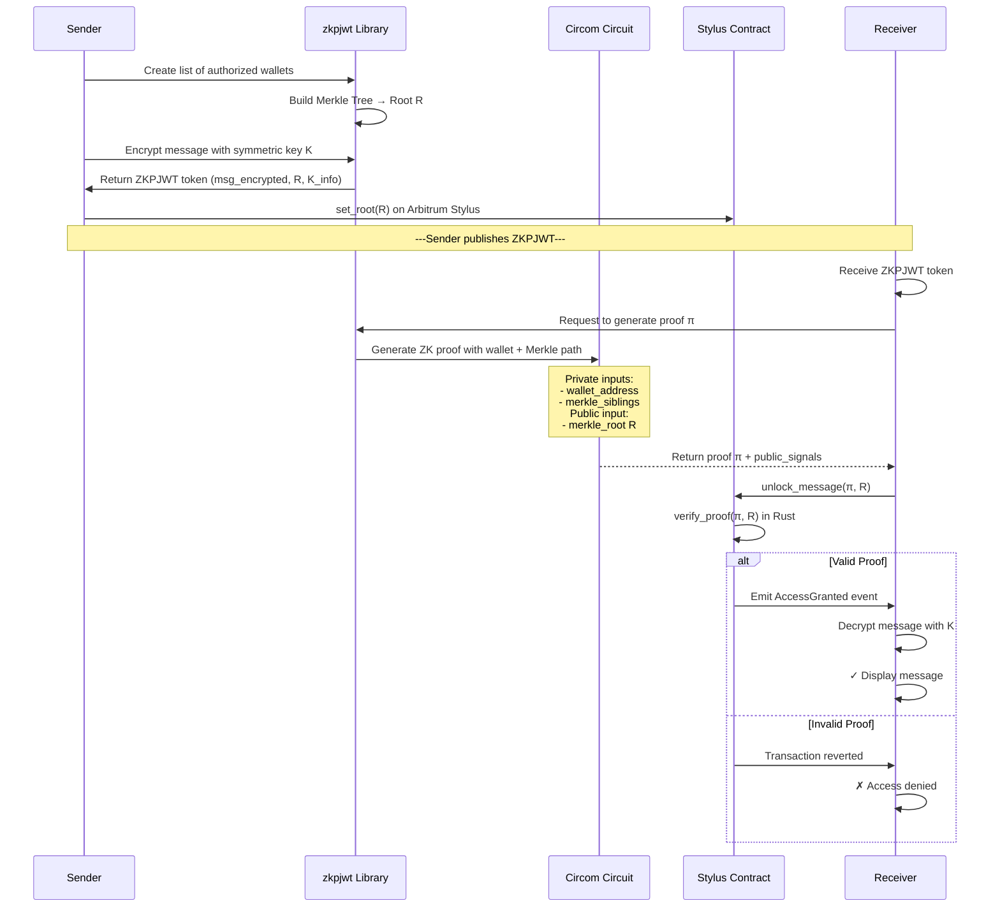

# ARG25 Project Submission

Welcome to Invisible Garden - ARG25.

Each participant or team will maintain this README throughout the program.  
You'll update your progress weekly **in the same PR**, so mentors and reviewers can track your journey end-to-end.

## 🔐 Project Title
**ZKPJWT - Zero-Knowledge Proof JSON Web Token Protocol**

## Team
- Team/Individual Name: **DevCristobalvc**
- GitHub Handles: [@DevCristobalvc](https://github.com/DevCristobalvc)
- Devfolio Handles: [@DevCristobalvc](https://devfolio.co/@DevCristobalvc)

## Project Description

**ZKPJWT** is a decentralized protocol for access control to encrypted data using **Zero-Knowledge Proofs** and cryptographic tokens inspired by JWT. The first implementation allows encrypted messaging where only members of an authorized group can decrypt messages, all without revealing their specific identity.

### 🎯 The Problem
Current encrypted messaging systems have critical limitations:
- **Centralized Access Control**: You depend on a server to verify permissions
- **No Privacy in Verification**: You must reveal your identity to prove access rights
- **Lack of Auditability**: Can't publicly verify who has access without compromising privacy
- **No On-Chain Integration**: Can't use smart contracts for programmable access rules

### 💡 The Solution
ZKPJWT enables:
- **Privacy-Preserving Access**: Prove you're in an authorized group without revealing which member you are
- **Decentralized Verification**: Smart contracts verify proofs on-chain (Arbitrum Stylus)
- **Programmable Access Control**: Define complex access rules using blockchain logic
- **Auditable & Transparent**: Anyone can verify the access rules, but not who accessed

### 🏗️ Technical Architecture

### 🔐 Message Access Flow

## Tech Stack

### Blockchain
- **Arbitrum Sepolia Testnet** (Stylus enabled)
- **Rust** (Smart contract in Stylus)
- **Cargo Stylus** (Deployment toolchain)

### Zero-Knowledge
- **Circom** (ZK circuit for Merkle proof)
- **SnarkJS** (Proof generation)
- **Groth16** (Proving system)

### Off-Chain Library
- **TypeScript** (zkpjwt NPM package)
- **MerkleTreeJS** (Merkle tree construction)
- **Ethers.js** (Blockchain interaction)

### Frontend Demo
- **React + TypeScript**
- **Vite** (Build tool)
- **MetaMask** (Wallet connection)

### Encryption
- **AES-256-GCM** (Message encryption)
- **Poseidon Hash** (ZK-friendly hashing)

## Objectives

### Week 1 (Oct 24-31)
- ✅ Define ZKPJWT protocol architecture
- ⏳ Design Circom circuit for Merkle membership proof
- ⏳ Setup Arbitrum Stylus development environment
- ⏳ Implement basic Rust verifier contract skeleton

### Week 2 (Nov 1-7)
- Implement complete zkpjwt NPM library (Merkle tree, encryption, ZKPJWT generation)
- Complete Stylus Rust contract with proof verification
- Deploy to Arbitrum Sepolia
- Test proof generation and on-chain verification

### Week 3 (Nov 8-14)
- Build React demo UI (sender and receiver flows)
- End-to-end testing (encrypt → prove → verify → decrypt)
- Optimize gas costs on Stylus
- Documentation and demo video

## Weekly Progress

### Week 1 (ends Oct 31)
**Goals:**
- Research Arbitrum Stylus documentation and Rust SDK
- Design Circom circuit for set membership (Merkle proof verification)
- Define ZKPJWT token structure (JSON format)
- Create project monorepo structure (circuits/ + contracts/ + library/ + frontend/)

**Progress Summary:**  
✅ **Architecture defined**: Designed complete flow from encryption to on-chain verification  
✅ **Tech stack selected**: Arbitrum Stylus (Rust) + Circom + TypeScript library  
⏳ **In progress**: Circom circuit implementation for Merkle membership proof  

### Week 2 (ends Nov 7)
**Goals:**  
- Complete zkpjwt TypeScript library with core functions:
  - `createMerkleTree(wallets: string[])`
  - `encryptMessage(message: string, key: Buffer)`
  - `generateZKPJWT(encrypted: string, root: string)`
  - `generateProof(wallet: string, merkleTree: MerkleTree)`
- Implement Stylus Rust contract with:
  - `set_root(bytes32 root)` - Store Merkle root
  - `verify_proof(bytes proof, bytes32[] public_inputs)` - Verify ZK proof
  - `unlock_message(bytes proof, bytes32 root)` - Main access function
- Deploy to Arbitrum Sepolia testnet

**Progress Summary:**  
_Will be updated at the end of the week..._

### 🗓️ Week 3 (ends Nov 14)
**Goals:**  
- Build React demo with two panels:
  - **Sender**: Generate ZKPJWT, encrypt message, publish root on-chain
  - **Receiver**: Connect wallet, generate proof, verify on-chain, decrypt message
- Implement event listener for `AccessGranted` in frontend
- Gas optimization analysis (compare Stylus vs standard Solidity)
- Record demo video showing full flow
- Write technical documentation and protocol specification

**Progress Summary:**  
_Will be updated at the end of the week..._

## Final Wrap-Up
_After Week 3, summarize your final state: deliverables, repo links, and outcomes._

- **Main Repository Link:** [https://github.com/DevCristobalvc/zkp-jwt](https://github.com/DevCristobalvc/zkp-jwt)
- **Demo / Deployment Link (if any):** [Pending]
- **Slides / Presentation (if any):** [Pending]

## 🧾 Learnings
_What did you learn or improve during ARG25?_

- **Arbitrum Stylus Development**: First hands-on experience writing smart contracts in Rust for EVM
- **ZK Circuit Design**: Implementing Merkle membership proofs with Circom
- **Hybrid Encryption**: Combining symmetric encryption (AES) with asymmetric key management
- **Protocol Design**: Creating a reusable standard (ZKPJWT) for privacy-preserving access control
- **Gas Optimization**: Understanding Stylus performance benefits vs traditional Solidity

## Next Steps
_If you plan to continue development beyond ARG25, what's next?_

### 🚀 Protocol Expansion (ZKPJWT v2)
- **Use Case 2**: Token-gated content (prove you hold X tokens without revealing balance)
- **Use Case 3**: Credential verification (prove you have a diploma/certificate without showing it)
- **Use Case 4**: Anonymous voting (already explored in Glacier project)

### 🔧 Technical Improvements
- **Recursive Proofs**: Aggregate multiple proofs for batch verification
- **Multi-Chain Support**: Deploy on Polygon zkEVM, zkSync, Scroll
- **Decentralized Key Management**: Implement threshold encryption for symmetric key K
- **Mobile SDK**: React Native library for mobile wallet integration

### 📦 NPM Package Release
- Publish `zkpjwt` to npm registry
- Complete API documentation
- Integration examples (Express.js, Next.js, etc.)
- Security audit from third party

### 🌍 Real-World Applications
- **Healthcare**: Share encrypted medical records only with authorized doctors
- **Legal**: Secure document sharing between authorized parties
- **DeFi**: Proof of compliance without revealing personal data
- **DAOs**: Privacy-preserving membership verification

---

## 🎯 Why This Matters for Arbitrum

**ZKPJWT leverages Arbitrum Stylus to make Zero-Knowledge verification accessible and efficient.**

Key innovations:
- 🔥 **10x cheaper gas costs** for ZK proof verification compared to Solidity
- ⚡ **Near-native performance** using Rust on WASM
- 🛠️ **Developer-friendly**: Rust ecosystem instead of complex ZK DSLs
- 🌐 **Composable**: ZKPJWT tokens can be used across any EVM chain

This project demonstrates that Stylus isn't just faster—it enables **new use cases** that were economically unfeasible before.

---

## 📚 Resources & Links

- **Arbitrum Stylus Docs**: [https://docs.arbitrum.io/stylus/stylus-gentle-introduction](https://docs.arbitrum.io/stylus/stylus-gentle-introduction)
- **Circom Documentation**: [https://docs.circom.io/](https://docs.circom.io/)
- **JWT Standard (RFC 7519)**: [https://datatracker.ietf.org/doc/html/rfc7519](https://datatracker.ietf.org/doc/html/rfc7519)
- **Original Repo**: [https://github.com/DevCristobalvc/zkp-jwt](https://github.com/DevCristobalvc/zkp-jwt)

_This template is part of the [ARG25 Projects Repository](https://github.com/invisible-garden/arg25-projects)._  
_Update this file weekly by committing and pushing to your fork, then raising a PR at the end of each week._