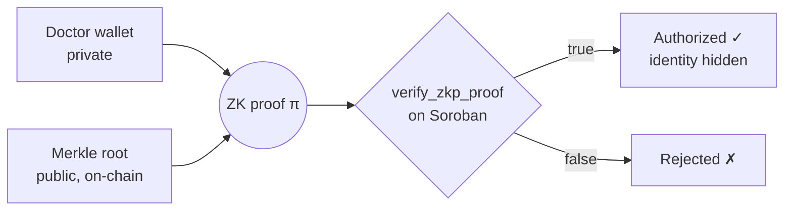
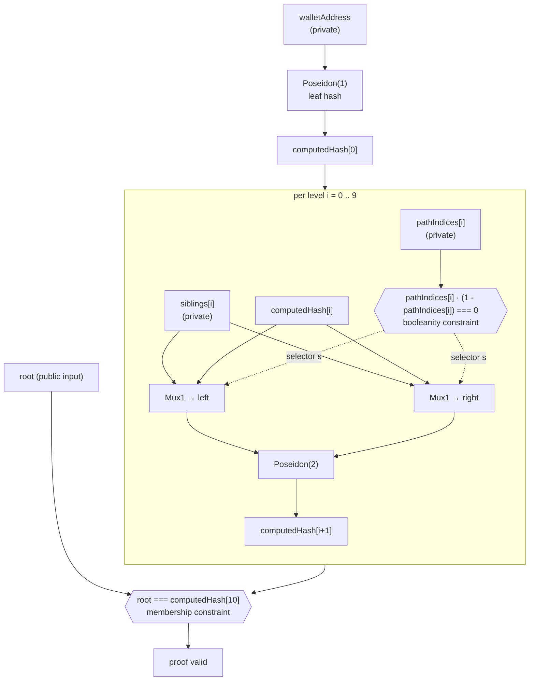
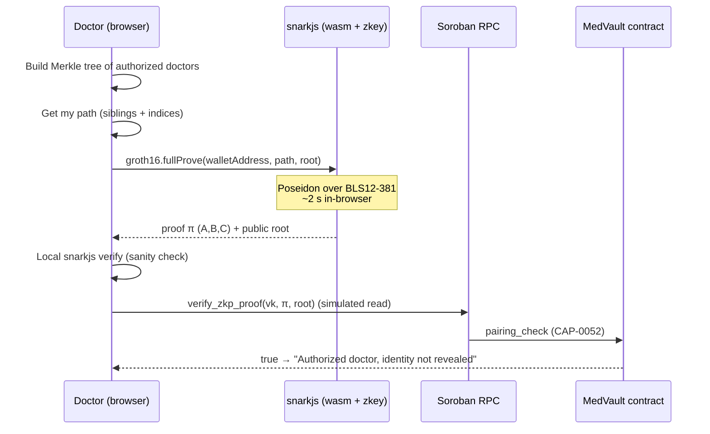

# MedVault ZK — Anonymous Doctor Membership on Stellar

Zero-knowledge layer for [MedVault](https://github.com/DevCristobalvc/medvault-stellar). A doctor proves they belong to an
authorized provider set **without revealing which member they are**. The proof is generated in the browser and verified
**on-chain** by the MedVault Soroban contract using Stellar's native BLS12-381 pairing host function (CAP-0052).

This folder is the Stellar adaptation of the original Arbitrum/Stylus [ZKPJWT](../README.md) protocol: same Merkle-membership
idea, but ported to the BLS12-381 curve and Poseidon parameters that Stellar verifies natively.

- **Curve:** BLS12-381 (`circom --prime bls12381`)
- **Hash:** Poseidon over the BLS12-381 scalar field
- **Proof system:** Groth16 (snarkjs)
- **Circuit:** `circuits/merkle_membership_stellar.circom` — 10 levels, **5615 constraints**
- **On-chain verifier:** `verify_zkp_proof` on contract `CBYNTUAVZ4OSILWID7HE6AYF7FNOJTT2M77TZJ6GUU32VGBXUCMIUBBK`

---

## 1. The idea (simple view)

A clinic publishes a Merkle root of all credentialed doctors. A doctor later proves "my wallet is one of the leaves under
that root" — the contract learns *that* the doctor is authorized, never *which* doctor.



What stays private: the wallet address and its position in the tree.
What is public: only the Merkle root and the yes/no result.

---

## 2. The circuit (detailed view)

`MerkleMembershipStellar(levels=10)` hashes the wallet into a leaf, then walks 10 levels up the tree, hashing with the
correct sibling order at each step, and finally asserts the recomputed root equals the public root.



**Signals**

| Signal | Visibility | Meaning |
|---|---|---|
| `walletAddress` | private | Doctor's Stellar public key as a field element |
| `pathIndices[10]` | private | Per-level bit: 0 = node is left child, 1 = right child |
| `siblings[10]` | private | Sibling hash at each level of the Merkle path |
| `root` | **public** | Merkle root of the authorized set (stored on-chain) |

**Two constraint families make it sound**

1. **Membership** — `root === computedHash[levels]`. The witness only satisfies this if the leaf truly hashes up to the
   published root.
2. **Booleanity** — `pathIndices[i] * (1 - pathIndices[i]) === 0` for every level. This was added after an audit of the
   circuit: circomlib's `Mux1` computes `out = (c[1]-c[0])*s + c[0]` and does **not** range-check `s`. Without the explicit
   booleanity constraint a malicious prover could pick a non-binary selector (e.g. `s = 2`) to forge an alternate path and
   land on the real root. The constraint closes that under-constraint. See `test/validate_circuit.mjs` test 3.

---

## 3. End-to-end UX (what the user does)

In-browser proving on the MedVault **Protocol** page, then live on-chain verification — no backend, no trusted prover.



The verification key is passed as a call argument, so **rotating the circuit needs no contract redeploy** — only new
`vk`, `zkey`, and `wasm` artifacts.

---

## 4. On-chain verification

`verify_zkp_proof` runs the full Groth16 equation on Stellar's native BLS12-381 host functions:

```
e(−A, B) · e(α, β) · e(L, γ) · e(C, δ) == 1     where  L = IC₀ + root · IC₁
```

- G1 points: 96 bytes (`x‖y`, 48 each, big-endian). G2 points: 192 bytes, Fp2 in `c1`-first order
  (`x.c1‖x.c0‖y.c1‖y.c0`), matching Stellar's zkcrypto serialization.
- Single public input: the Merkle `root`.
- Reference verifier source: `src/groth16_bls12381.rs` (mirrors the logic deployed in the MedVault contract).

---

## 5. Layout

```
stellar/
├── circuits/
│   └── merkle_membership_stellar.circom   # the circuit (levels=10, BLS12-381, Poseidon)
├── src/
│   ├── groth16_bls12381.rs                # Soroban Groth16 verifier reference
│   └── stellar_prover.ts                  # proving helper (Node)
├── test/
│   ├── bls_poseidon.mjs                   # Poseidon over BLS12-381 scalar field (reference)
│   ├── validate_circuit.mjs               # completeness + soundness + booleanity suite
│   ├── verify_onchain.mjs                 # generate proof + verify on the live contract
│   └── zkp_fixture.json                   # known-good proof fixture (verifies on-chain: true)
└── build/                                 # compiled r1cs / wasm / zkey / vk (generated)
```

The browser-facing copies of the proving artifacts live in the MedVault frontend:
`medvault-stellar/frontend/public/zkp/merkle.wasm`, `merkle.zkey`, and
`frontend/src/lib/zkp/vkey_bls12381.json`.

---

## 6. Reproduce

```bash
cd zkp-jwt/stellar
npm install

# Compile the circuit (r1cs + wasm + sym) over BLS12-381
npm run compile

# Validate completeness, soundness, and booleanity
node test/validate_circuit.mjs            # 4 passed, 0 failed

# Generate a fresh proof and verify it against the live contract
DUMP_FIXTURE=1 node test/verify_onchain.mjs   # on-chain result: true
```

> **Trusted setup note:** the committed `zkey` uses a single development contribution from a Powers-of-Tau (pot14)
> ceremony. A multi-party ceremony is required before any mainnet use.

---

*Part of the MedVault submission — Stellar PULSO Hackathon · 2026 · Colombia*
